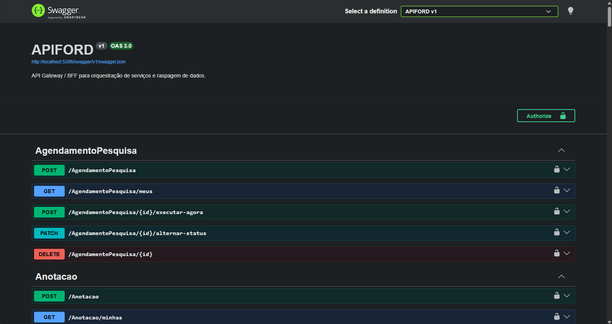
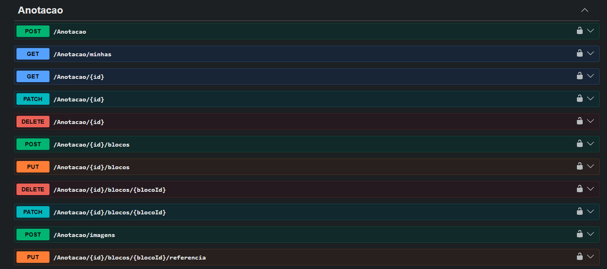
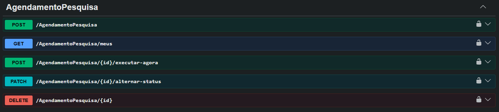
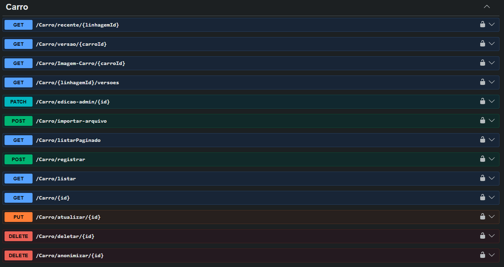
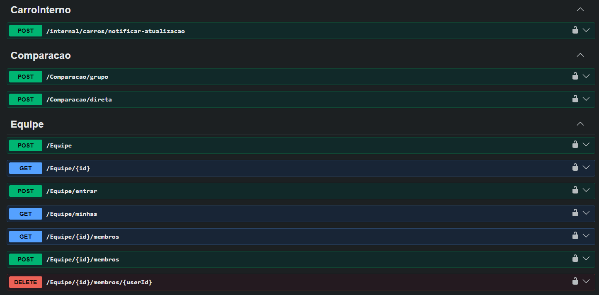

# API, Swagger e erros

Voltar ao [README central](../README.md).

## Swagger / OpenAPI

Ligado em todo ambiente (`UseSwagger` + `UseSwaggerUI`). Documento `v1`, título APIFORD.

Esquema **Bearer JWT** no cadeado. Cole só o token de `POST /User/login`.

Comentários `///` nos controllers alimentam a descrição quando `GenerateDocumentationFile` está no `.csproj`. A inclusão explícita do XML no `AddSwaggerGen` ainda está comentada no `Program.cs` — se alguma descrição sumir no UI, descomentar o `IncludeXmlComments`.

### Prints











## Formato de erro

Toda exceção de domínio passa pelo `ExceptionMiddleware`:

```json
{ "status": 404, "message": "..." }
```

| Exceção | HTTP |
|---|---|
| `BadRequestException` / `ArgumentException` | 400 |
| `UnauthorizedException` | 401 |
| `ForbiddenException` | 403 |
| `NotFoundException` | 404 |
| `ConflictException` | 409 |
| `ValidationException` | 422 |
| `ExternalServiceException` | 502 |
| `ServiceUnavailableException` | 503 |
| qualquer outra | 500 com mensagem genérica (não vaza stack) |

401/403 do **middleware de JWT** (token ausente/inválido, role errada) vêm do ASP.NET, não desse JSON — os testes de integração cobrem os dois casos.

## Verbos

GET leitura, POST criação/ação, PUT/PATCH alteração, DELETE remoção. Parte das rotas ainda usa verbo no path (`/Carro/listar`, `/Carro/registrar`) por legado do `BaseController`. Anotação e agendamento estão mais próximos de recurso (`/Anotacao/{id}/blocos`).
