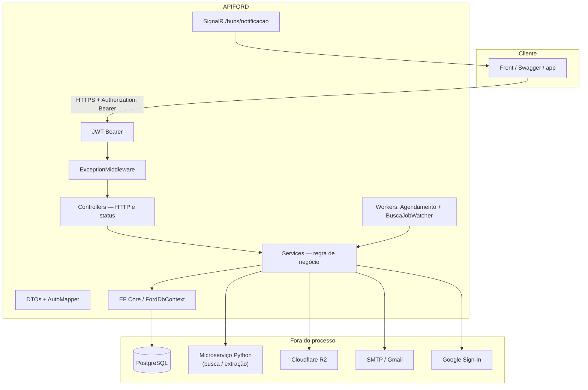

# Arquitetura (SOA)

Voltar ao [README central](../README.md).

A API é o **BFF / gateway** do Beyond Compare. Não é um SOAP. Serviços se separam por responsabilidade e se falam por HTTP + banco compartilhado.

## Camadas

| Camada | Faz | Não faz |
|---|---|---|
| Controllers | Rota, verbo HTTP, status | Regra de negócio |
| Services (`*Service`) | Orquestra EF, Python, storage, e-mail | Montar `IActionResult` |
| DTOs + AutoMapper | Contrato de entrada/saída | Expor entidade do banco crua |
| `ExceptionMiddleware` | Converte exceção de domínio em `{ status, message }` | — |
| JWT | Identidade e role **antes** do controller | — |
| Workers | Agenda pesquisa e acompanha job Python | Endpoint HTTP |

Services são registrados automaticamente (Scrutor): classes em `APIFORD.Services` cujo nome termina com `Service`, scoped, exceto `IHostedService`.

## Fluxo de uma busca

1. Front autenticado chama `POST /Pesquisa/busca`.
2. `PesquisaService` chama o Python (`Python:Url` + `X-Api-Key`).
3. Python cria o job no Postgres e devolve `job_id`.
4. A API grava o `UserId` no job (o Python não conhece o usuário).
5. `BuscaJobWatcherService` observa o término e a API expõe `GET /Pesquisa/jobs/{id}`.
6. Carro extraído entra no catálogo; comparação / exportação leem o mesmo schema.

## Fluxo de autenticação

Ver [autenticacao.md](autenticacao.md). Resumo: `POST /User/login` → JWT → header `Authorization` nas rotas `[Authorize]`.

## Workers

| Worker | Papel |
|---|---|
| `AgendamentoWorker` | Dispara pesquisas agendadas (`AgendamentoPesquisa`, escuta de lançamento) |
| `BuscaJobWatcherService` | Acompanha jobs do Python até fechar o ciclo |

## Integrações

- **Python** — extração da ficha a partir de URL / HTML. Cabeçalho interno `X-Api-Key`.
- **R2** — foto de perfil e imagens de anotação (`IArmazenamentoService`). Bucket é criado no startup.
- **E-mail** — recuperação de senha e avisos (`GmailEmailSenderService` / SMTP).
- **Rota interna** — `POST /internal/carros/notificar-atualizacao` protegida por `X-Internal-Api-Key` (`InternalApiKeyAttribute`), para o Python avisar atualização de carro.

## Banco

PostgreSQL + Npgsql. Naming snake_case. JSON de especificações em colunas `jsonb` (por isso o teste de integração **não** usa EF InMemory).

Há dois `AddDbContext` no `Program.cs` (histórico). O que vale em runtime é o Npgsql com retry + snake_case.
